<p align="center">
  
  
  
  
  
  
</p>

<h1 align="center">🔐 Authentification Biométrique Décentralisée</h1>
<h3 align="center">Self-Sovereign Identity (SSI) + Zero-Knowledge Proofs (ZKP)</h3>

<p align="center">
  <i>L'utilisateur prouve son identité <b>sans jamais partager ses données biométriques</b>.</i><br/>
  <i>Le serveur <b>ne voit, ne stocke et ne transmet AUCUNE donnée biométrique</b>.</i>
</p>

<p align="center">
  
  
  
</p>

---

## 📋 Table des Matières

- [Contexte et Problématique](#-contexte-et-problématique)
- [Solution Proposée](#-solution-proposée)
- [Architecture du Système](#-architecture-du-système)
- [Diagrammes de Séquence](#-diagrammes-de-séquence)
- [Technologies Utilisées](#-technologies-utilisées)
- [Structure du Projet](#-structure-du-projet)
- [Installation](#-installation)
- [Utilisation](#-utilisation)
- [Composants Techniques](#-composants-techniques)
- [Sécurité et Conformité](#-sécurité-et-conformité)
- [Glossaire](#-glossaire)
- [Auteurs](#-auteurs)

---

## 🎯 Contexte et Problématique

### Problèmes actuels des systèmes biométriques classiques

| Problème | Conséquence |
|:---|:---|
| 🔴 Centralisation des données biométriques | Risque de fuite massive (ex: Aadhaar, OPM) |
| 🔴 Stockage serveur du template facial | Usurpation d'identité si la base est compromise |
| 🔴 Aucun contrôle utilisateur | Non-conformité RGPD, atteinte à la vie privée |
| 🔴 Transmission de données sensibles | Vulnérabilité aux attaques MITM |

### Question centrale

> *Comment authentifier un utilisateur par biométrie faciale **sans jamais révéler ni stocker** ses données biométriques côté serveur ?*

---

## 💡 Solution Proposée

Le système combine **trois paradigmes de sécurité** :

| Paradigme | Rôle |
|:---|:---|
| 🆔 **SSI — Self-Sovereign Identity** | L'utilisateur possède un **DID** et des **Verifiable Credentials**. Il est le seul propriétaire de son identité numérique. |
| 🔒 **ZKP — Zero-Knowledge Proofs** | L'utilisateur prouve qu'il possède un template facial valide **sans révéler le template**. Le serveur vérifie la preuve mathématique sans accéder aux données. |
| 📱 **Matching Local** | La comparaison faciale est effectuée **exclusivement côté client**. Aucun template ne transite sur le réseau. |

### Garanties de confidentialité

```
╔══════════════════════════════════════════════════════════════════╗
║  Le serveur ne voit JAMAIS :                                    ║
║    ✗ Le visage de l'utilisateur                                 ║
║    ✗ Le template biométrique T_u (128 dimensions)               ║
║    ✗ L'aléa cryptographique r                                   ║
║    ✗ Le nouveau template T'_u capturé lors du login             ║
║                                                                  ║
║  Le serveur stocke UNIQUEMENT :                                  ║
║    ✓ Le DID (identifiant décentralisé)                          ║
║    ✓ L'engagement C = H(T_u || r) — hash irréversible          ║
║    ✓ La clé publique PK                                         ║
╚══════════════════════════════════════════════════════════════════╝
```

---

## 🏗 Architecture du Système

```
┌─────────────────────────────────────┐      HTTPS / TLS      ┌──────────────────────────────────┐
│          CLIENT (Utilisateur)       │◄──────────────────────►│    SERVEUR D'AUTHENTIFICATION     │
│                                     │                        │                                  │
│  1. Capture Visage (OpenCV)         │   Enrôlement :         │  A. Réception {DID, C, PK}       │
│  2. Extraction Template T_u (128D)  │   {DID, C, PK} ──────►│  B. Vérification DID             │
│  3. Matching Local : d(T_u,T'_u)<τ  │                        │  C. Stockage métadonnées         │
│  4. Preuve ZKP : π                  │   Authentification :   │  D. Émission VC                  │
│  5. Stockage Local Sécurisé         │   {π, DID, VC} ──────►│                                  │
│                                     │                        │  Vérification :                  │
│  ┌── WALLET SSI LOCAL ───────────┐  │                        │  1. Vérifier VC (signature)      │
│  │ • Template T_u (128D)         │  │                        │  2. Vérifier ZKP π               │
│  │ • Aléa r (32 octets)         │  │   ◄── Résultat ────── │  3. ACCEPTÉ / REJETÉ             │
│  │ • Clé privée SK (RSA-2048)   │  │                        │                                  │
│  │ • DID (did:key:...)          │  │                        │  ┌── BASE DE DONNÉES ──────────┐ │
│  │ • Verifiable Credentials     │  │                        │  │ DID     │ C (hash)    │ PK  │ │
│  └───────────────────────────────┘  │                        │  │ Date    │ (PAS de biométrie) │ │
│                                     │                        │  └─────────────────────────────┘ │
│  ⚠️ Biométrie = TOUJOURS LOCALE     │                        │  ⚠️ AUCUNE biométrie stockée     │
└─────────────────────────────────────┘                        └──────────────────────────────────┘
```

---

## 📊 Diagrammes de Séquence

### Phase A — Enrôlement (Inscription)

> Le client génère son identité SSI, extrait le template biométrique, calcule l'engagement `C = H(T_u || r)`, puis envoie **uniquement** `{DID, C, PK}` au serveur. Le serveur émet un Verifiable Credential en retour.

```mermaid
sequenceDiagram
    participant U as 👤 Utilisateur
    participant C as 💻 Client
    participant S as 🖥️ Serveur

    U->>C: Place visage devant webcam

    rect rgb(30, 60, 90)
        Note over C: Opérations LOCALES (côté client uniquement)
        C->>C: 1. Capture image (OpenCV)
        C->>C: 2. Extraction template T_u (128D)
        C->>C: 3. Génération aléa r = urandom(32)
        C->>C: 4. Calcul C = SHA-256(T_u || r)
        C->>C: 5. Génération DID + clés RSA-2048
    end

    C->>S: Envoi {DID, C, PK} uniquement
    Note over C,S: ❌ Pas de T_u, pas de r, pas d'image

    rect rgb(60, 30, 60)
        Note over S: Opérations SERVEUR
        S->>S: 6. Vérifie DID non existant
        S->>S: 7. Stocke {DID, C, PK, date} en SQLite
        S->>S: 8. Émet Verifiable Credential (VC)
    end

    S-->>C: Retourne {VC signé}
    C->>C: 9. Sauvegarde wallet local (T_u, r, SK, VC)
```



### Phase B — Authentification (Login)

> Le client effectue le matching biométrique **localement**. Si le visage correspond, il génère une preuve ZKP `π` et l'envoie au serveur avec le DID et le VC. Le serveur vérifie la preuve **sans jamais voir les données biométriques**.

```mermaid
sequenceDiagram
    participant U as 👤 Utilisateur
    participant C as 💻 Client
    participant S as 🖥️ Serveur

    U->>C: Place visage + sélectionne DID

    rect rgb(30, 60, 90)
        Note over C: Opérations LOCALES
        C->>C: 1. Capture nouveau template T'_u
        C->>C: 2. Charge wallet (T_u, r, SK)
        C->>C: 3. Matching LOCAL : d(T_u, T'_u) < 0.5 ?
    end

    alt Distance ≥ 0.5
        Note over U,C: ❌ Échec — Rien n'est envoyé au serveur
    else Distance < 0.5
        rect rgb(30, 60, 90)
            C->>C: 4. Génère preuve ZKP π (Fiat-Shamir)
        end

        C->>S: Envoi {π, DID, VC}
        Note over C,S: ❌ Toujours pas de T_u, pas d'image

        rect rgb(60, 30, 60)
            Note over S: Vérifications SERVEUR
            S->>S: 5. Vérifie VC (signature serveur)
            S->>S: 6. Vérifie ZKP (challenge + hash + signature RSA + timestamp)
        end

        S-->>C: ✅ ACCEPTÉ ou ❌ REJETÉ
    end
```



---

## 🛠 Technologies Utilisées

| Composant | Technologie | Rôle |
|:---|:---|:---|
| 🐍 Langage | **Python 3.9+** | Langage principal (client + serveur) |
| 📷 Vision | **OpenCV 4.x** | Capture webcam + détection de visage (Haar Cascade) |
| 🧬 Biométrie | **face_recognition** / Simulation | Extraction template 128D |
| 🔐 Cryptographie | **cryptography** (RSA-2048, SHA-256) | Signatures, engagement, chiffrement |
| 🌐 API | **Flask** | API REST du serveur (HTTPS) |
| 💾 Base de données | **SQLite 3** | Stockage métadonnées serveur |
| 🎫 Auth API | **PyJWT** | Tokens JWT avec expiration |
| 🔒 HTTPS | **pyOpenSSL** | Certificats auto-signés (TLS) |
| 🖥️ Interface | **Tkinter** | Application graphique client |
| 🆔 SSI | Implémentation custom (`did:key`) | DID, Verifiable Credentials (W3C) |
| 🧮 ZKP | **Fiat-Shamir** + Signatures RSA-PSS | Preuve sans divulgation |

---

## 📁 Structure du Projet

```
Authentification-D-centralis-e/
│
├── 📂 client/                          # APPLICATION CLIENT (SSI + ZKP)
│   ├── client_app.py                   # Interface graphique Tkinter
│   ├── biometrics.py                   # Capture webcam + extraction template 128D
│   ├── ssi_wallet.py                   # Wallet SSI : DID, clés RSA, VC
│   ├── zkp_prover.py                   # Génération de la preuve ZKP (π)
│   └── 📂 wallet_data/                 # Stockage local du wallet
│       ├── <did_hash>.json             #   → Template, aléa, credentials
│       └── <did_hash>_sk.pem           #   → Clé privée RSA
│
├── 📂 serveur/                         # SERVEUR D'AUTHENTIFICATION
│   ├── api.py                          # API Flask (HTTPS + JWT)
│   ├── database.py                     # SQLite (DID, C, PK — PAS de biométrie)
│   ├── zkp_verifier.py                 # Vérification de la preuve ZKP
│   ├── ssi_registry.py                 # Registre DID + émission VC
│   └── serveur_db.sqlite              # Base de données (auto-générée)
│
├── 📂 common/                          # UTILITAIRES PARTAGÉS
│   ├── __init__.py
│   └── crypto_utils.py                 # C = H(T_u || r), SHA-256, distance
│
├── requirements.txt                    # Dépendances Python
├── run_serveur.bat                     # 🚀 Lancer le serveur (Windows)
├── run_client.bat                      # 🚀 Lancer le client (Windows)
└── README.md                           # Ce fichier
```

---

## ⚙️ Installation

### Prérequis

- **Python 3.9+** installé
- **Webcam** fonctionnelle (ou le système utilisera la simulation Haar Cascade)
- Connexion réseau locale (client et serveur sur la même machine)

### Étapes

```bash
# 1. Cloner le dépôt
git clone https://github.com/SlahEddine-Boujarra/Authentification-D-centralis-e.git
cd Authentification-D-centralis-e

# 2. Créer un environnement virtuel (recommandé)
python -m venv venv
source venv/bin/activate        # Linux/macOS
venv\Scripts\activate           # Windows

# 3. Installer les dépendances
pip install -r requirements.txt

# 4. (Optionnel) Installer face_recognition pour le mode réel
# Nécessite dlib + CMake
pip install face_recognition
```

**Dépendances principales :**
```
flask, requests, cryptography, opencv-python, numpy, Pillow, PyJWT, pyOpenSSL
```

> [!NOTE]
> Si `face_recognition` n'est pas installé, le système fonctionne automatiquement en **mode simulation** : la détection de visage utilise Haar Cascade (OpenCV) et le template 128D est simulé. Ce mode est suffisant pour démontrer le fonctionnement du protocole SSI+ZKP.

---

## 🚀 Utilisation

### Étape 1 — Lancer le Serveur

```bash
# Double-cliquer sur run_serveur.bat ou exécuter :
cd serveur
python api.py
```

Le serveur démarre en HTTPS sur `https://127.0.0.1:5050` :
```
================================================================
  SERVEUR SSI + ZKP — Authentification Décentralisée
  HTTPS activé | JWT activé | Aucune biométrie stockée
================================================================
  DID Serveur  : did:key:a1b2c3d4...
  Adresse      : https://127.0.0.1:5050
  Base données : serveur_db.sqlite
================================================================
```

### Étape 2 — Lancer le Client

```bash
# Dans un NOUVEAU terminal :
cd client
python client_app.py
```

### Étape 3 — Enrôlement (Inscription)

1. 📷 Placez votre visage devant la webcam
2. 🖱️ Cliquez sur **« Enrôlement (SSI) »**
3. ✅ Le système :
   - Capture votre visage et extrait le template `T_u` (128D)
   - Génère votre identité SSI (DID + clés RSA-2048)
   - Calcule l'engagement `C = H(T_u || r)`
   - Envoie au serveur **uniquement** : `{DID, C, PK}`
   - Reçoit un Verifiable Credential (VC) du serveur
   - Stocke **tout localement** dans votre wallet

### Étape 4 — Authentification (Login)

1. 📷 Placez votre visage devant la webcam
2. 🖱️ Cliquez sur **« Authentification (ZKP) »**
3. 📋 Sélectionnez votre DID dans la liste déroulante
4. ✅ Le système :
   - Capture un nouveau template `T'_u`
   - Compare **localement** : `d(T_u, T'_u) < τ` (seuil `τ = 0.5`)
   - Si le matching réussit → Génère la preuve ZKP `π`
   - Envoie au serveur : `{π, DID, VC}` — **aucune biométrie !**
   - Le serveur vérifie le VC et la preuve ZKP
   - Résultat : ✅ **ACCEPTÉ** ou ❌ **REJETÉ**

---

## 🔧 Composants Techniques

### Engagement Cryptographique (Commitment Scheme)

```
C = SHA-256( T_u || r )
```

| Élément | Description |
|:---|:---|
| `T_u` | Template biométrique — vecteur 128D (floats) |
| `r` | Aléa cryptographique — 32 octets (`os.urandom(32)`) |
| `C` | Engagement — hash irréversible, stocké sur le serveur |

> Le serveur stocke `C` mais **ne peut jamais retrouver** `T_u` ni `r` (propriété de résistance à la préimage de SHA-256).

### Preuve Zero-Knowledge (ZKP — Fiat-Shamir)

La preuve `π` démontre l'affirmation suivante sans révéler aucun secret :

```
∃ (T_u, r) :  C = H(T_u || r)  ∧  d(T_u, T'_u) < τ
```

**Construction de la preuve :**

```
1. Engagements aveugles (blinding) :
   blinded_T = SHA-256(nonce₁ || T_u)
   blinded_r = SHA-256(nonce₂ || r)

2. Challenge de Fiat-Shamir (non-interactif) :
   challenge = SHA-256(C || blinded_T || blinded_r || τ || timestamp)

3. Réponses :
   response₁ = SHA-256(nonce₁ || challenge || T_u)
   response₂ = SHA-256(nonce₂ || challenge || r)

4. Hash de vérification :
   verification = SHA-256(response₁ || response₂ || challenge || C)

5. Signature RSA-PSS :
   signature = Sign_SK(serialize(π))
```

**Vérification côté serveur :**

| Étape | Vérification |
|:---|:---|
| ✅ Challenge | Recalcul du challenge Fiat-Shamir à partir des entrées publiques |
| ✅ Hash | Cohérence du hash de vérification |
| ✅ Signature | Validation RSA-PSS via la clé publique `PK` stockée |
| ✅ Timestamp | Fraîcheur de la preuve (max 120 secondes — anti-rejeu) |

### Self-Sovereign Identity (SSI)

| Composant | Implémentation |
|:---|:---|
| **DID** | `did:key:<SHA-256(PK)[:32]>` |
| **Paire de clés** | RSA-2048 (SK = client, PK = serveur) |
| **Verifiable Credential** | JSON-LD conforme au W3C VC Data Model, signé par le serveur |
| **Wallet** | Stockage local chiffré (`wallet_data/`) |

### Sécurité des Communications

| Couche | Technologie |
|:---|:---|
| 🔒 Transport | HTTPS (TLS) via certificats auto-signés (pyOpenSSL) |
| 🎫 Autorisation API | JWT (PyJWT) avec expiration 1 heure |
| ✍️ Signatures | RSA-PSS + SHA-256 |
| ⏱️ Anti-rejeu | Timestamp dans la preuve (max 120s) |

---

## 🛡 Sécurité et Conformité

### Matrice des Menaces

| Menace | Impact | Contre-mesure |
|:---|:---|:---|
| 🔓 Vol de la base serveur | **Nul** — Contient uniquement des hash `C` et des clés publiques | Engagement irréversible `C = H(T_u \|\| r)` |
| 🌐 Interception réseau (MITM) | Faible | HTTPS/TLS + JWT |
| 🎭 Usurpation biométrique | Faible | Matching local + ZKP signé par clé privée |
| 🔄 Attaque par rejeu | Faible | Timestamp dans la preuve (120s max) |
| 💻 Compromission du client | Moyen | Template stocké dans le wallet local uniquement |

### Conformité Normative

| Norme | Application |
|:---|:---|
| 🇪🇺 **RGPD** | Aucune donnée biométrique stockée côté serveur. Droit à l'oubli : suppression du wallet |
| 📋 **ISO 27001** | Gestion des actifs (engagement), contrôle d'accès (JWT), cryptographie (SHA-256, RSA) |
| 🔐 **ISO 27018** | Pas de stockage en clair, minimisation des données (engagement uniquement) |
| 🔑 **FIDO2** | Clé privée côté utilisateur, clé publique côté serveur, authentification sans mot de passe |

### Propriétés du Système

| Propriété | Statut |
|:---|:---|
| 🔒 Respect de la vie privée | ✅ Aucune donnée biométrique partagée |
| 🛡 Sécurité | ✅ ZKP empêche la divulgation de `T_u` et `r` |
| 👤 Contrôle utilisateur | ✅ Données stockées localement (SSI) |
| 🔗 Interopérabilité | ✅ Standards W3C DID, VC Data Model, API REST/JSON |
| ⚡ Performance | ✅ Temps d'authentification < 3 secondes |

---

## 📖 Glossaire

| Terme | Définition |
|:---|:---|
| **SSI** | *Self-Sovereign Identity* — L'utilisateur contrôle entièrement son identité numérique |
| **DID** | *Decentralized Identifier* — Identifiant unique décentralisé (ex: `did:key:abc123...`) |
| **VC** | *Verifiable Credential* — Attestation numérique signée par un émetteur de confiance |
| **ZKP** | *Zero-Knowledge Proof* — Preuve qu'une affirmation est vraie sans révéler d'information |
| **Commitment** | Engagement cryptographique `C = H(T_u \|\| r)`, irréversible |
| **Template** | Représentation mathématique (128D) d'un visage |
| **Fiat-Shamir** | Heuristique transformant un protocole interactif en preuve non-interactive |
| **JWT** | *JSON Web Token* — Jeton d'authentification sécurisé pour l'API |
| **RSA-PSS** | Schéma de signature probabiliste basé sur RSA |
| **MITM** | *Man-In-The-Middle* — Attaque par interception de communication |

---

## 👥 Auteurs

Projet académique — **Année universitaire 2025-2026**

---

<p align="center">
  <sub>🔐 <i>Aucune donnée biométrique n'a été compromise lors de la réalisation de ce projet.</i></sub>
</p>
